<p align="center">
  <picture>
    <source media="(prefers-color-scheme: dark)" srcset="frontend/icons/readme/hero-dark-en.svg">
    <source media="(prefers-color-scheme: light)" srcset="frontend/icons/readme/hero-light-en.svg">
    
  </picture>
</p>

<p align="center">
  <strong>Desktop app for Windows and CLI for Windows, macOS and Linux.</strong><br>
  Your machine is the engine: local GGUF models, OpenCode's free models or the provider you choose, fourteen specialists, live preview, visual Windows control, thousands of extensions and a pet that tells you what the agent is doing.
</p>

<p align="center">
  <a href="README.md">Español</a> · <a href="README.en.md">English</a> · <a href="https://tiancode.vercel.app/">Website</a> · <a href="https://github.com/Dreftian/Tiancode/releases/latest">Latest release</a> · <a href="CHANGELOG.md">Changelog</a>
</p>

<p align="center">
  <a href="https://github.com/Dreftian/Tiancode/releases/latest"></a>
  <a href="https://github.com/Dreftian/Tiancode/releases"></a>
  <a href="LICENSE"></a>
  <a href="https://github.com/Dreftian/Tiancode/stargazers"></a>
</p>

<p align="center">
  
  
  
  
  
  
  
  
  
  <a href="https://github.com/Dreftian/Tiancode/commits/dev"></a>
</p>

<p align="center">
  <a href="https://github.com/Dreftian/Tiancode/releases/latest/download/Tiancode.exe"></a>
  &nbsp;
  <a href="https://github.com/Dreftian/Tiancode/releases/latest/download/Tiancode-portable.exe"></a>
  &nbsp;
  <a href="#install-the-cli-windows-macos-and-linux"></a>
</p>

<p align="center">
  
</p>

<p align="center"></p>

## Table of contents

- [What's new in 1.0.0](#whats-new-in-100)
- [What is Tiancode](#what-is-tiancode)
- [Features](#features)
- [Screenshots](#screenshots)
- [Platforms](#platforms)
- [Quick start](#quick-start)
- [Install the desktop app (Windows)](#install-the-desktop-app-windows)
- [Install the CLI (Windows, macOS and Linux)](#install-the-cli-windows-macos-and-linux)
- [Using the CLI](#using-the-cli)
- [Configuration](#configuration)
- [Architecture](#architecture)
- [Development](#development)
- [Roadmap](#roadmap)
- [Contributing](#contributing)
- [Security and privacy](#security-and-privacy)
- [FAQ](#faq)
- [Credits and license](#credits-and-license)

## What's new in 1.0.0

Numbering starts again at 1.0.0 and includes everything released so far.

- 🆓 **OpenCode's free models.** The “OpenCode Free” group (Big Pickle, Exo, Fledge Alpha, Ling, LongCat, MiMo, Muse Spark, Nemotron, Space Bunny…) can be turned on in **Settings › Providers**, **Settings › Models** or the welcome wizard, with one switch per model. The list follows OpenCode's catalog and refreshes every hour.
- 🧭 **A 1200×850 welcome.** Six steps: language and theme; interface scale and conversation size with a preview; tabs, terminal and preview; timeline; free models; and what opens on start.
- 🐱 **The pet in the chat.** It sits next to Thinking, Exploring, Edit, Shell, questions and sub-agents, with the expression of what the model is doing.
- 🪟 **A preview that closes.** Closing the Sandbox no longer reopens it in a loop, for websites or apps.
- 🚀 **Code on start.** Code mode continues in your last project and only asks for a folder the first time.
- ⌨️ **A clearer CLI.** `tiancode run` reports provider retries and stops with the reason when the wait is long.

[Full changelog](CHANGELOG.md)

## What is Tiancode

Tiancode is a desktop fork of [OpenCode](https://github.com/sst/opencode) built by ZenithAI. The Windows app wraps the server and the interface in a native window with a tray, a pet, live preview and an updater; the CLI brings the same engine to the terminal on Windows, macOS and Linux.

Everything lives on your machine: sessions, agent memory and learned skills are stored in SQLite; GGUF models run on the native engine (llama.cpp), Ollama or LM Studio; and any cloud provider connects with its own key, which never leaves your machine except towards that provider.

<p align="center"></p>

## Features

<table>
  <tr>
    <td width="50%" valign="top"><h3>💬 Claude Code style chat</h3>Auto, Manual, Accept edits, Plan and Skip permissions modes that switch mid-task, an effort slider up to Ultracode, editable queued messages and a session summary.</td>
    <td width="50%" valign="top"><h3>🆓 OpenCode's free models</h3>“OpenCode Free” with one main switch and one per model; the list follows OpenCode's catalog. With your OpenCode Zen key you also get all of its paid models.</td>
  </tr>
  <tr>
    <td valign="top"><h3>🦙 Local GGUF models</h3>A Hugging Face explorer with the real size of each quantization, an “On disk” tab and automatic load settings for your VRAM and RAM. Ollama and LM Studio are used when they are running.</td>
    <td valign="top"><h3>🧩 Discover</h3>About 3,600 extensions: Claude Code and Codex plugins, skills and MCP servers from several registries. One-click installs that never clash with your names, and uninstalling removes exactly what was added.</td>
  </tr>
  <tr>
    <td valign="top"><h3>🔌 Connectors</h3>Around 300 apps with their real logos. Connecting adds the app's MCP server and opens its sign-in in your browser.</td>
    <td valign="top"><h3>🖥️ Visual Windows control</h3>The model reads screenshots and UI Automation context, clicks, drags and types. A blue light shows active control and “Stop now” cuts it off at once.</td>
  </tr>
  <tr>
    <td valign="top"><h3>👀 Sandbox and live view</h3>The agent starts, restarts and checks your app's server (Vite, Next, Astro, Remix, SvelteKit, Expo…), inspects the isolated page, and design mode sends an element to the chat.</td>
    <td valign="top"><h3>🤖 Fourteen specialists</h3>Sub-agents by category, each with its own editable model, temperature, steps, per-tool permissions, instructions and color.</td>
  </tr>
  <tr>
    <td valign="top"><h3>🛡️ Intelligence and protection</h3>User and project memory, CodeGraph, context compaction and pruning, AgentShield for critical commands and offline local decisions.</td>
    <td valign="top"><h3>🎙️ Voice</h3>Dictation with Whisper on your machine and spoken replies with Kokoro, Piper or Fish Audio, picking the voice by the language of each text.</td>
  </tr>
  <tr>
    <td valign="top"><h3>🐱 Pets</h3>Twelve animated characters: next to every step of the chat and, if you like, floating on the Windows desktop.</td>
    <td valign="top"><h3>📣 Notifications and pairing</h3>Task notifications on Telegram, Discord, Slack or a webhook, and a QR code to open Tiancode from another device on your network.</td>
  </tr>
  <tr>
    <td valign="top"><h3>🐙 GitHub</h3>Browse, clone and create repositories and commit from Connections; in the CLI, <code>tiancode github</code> and <code>tiancode pr</code>.</td>
    <td valign="top"><h3>⌨️ Cross-platform CLI</h3>Terminal UI, <code>run</code>, <code>serve</code>, <code>web</code>, <code>attach</code>, ACP for editors, sessions, statistics and management of providers, MCP and plugins.</td>
  </tr>
</table>

## Screenshots

| Home | Settings |
|---|---|
|  |  |
| **Local models** | **Load parameters** |
|  |  |
| **Sub-agents** | **MCP and plugins** |
|  |  |
| **Connections** | **Skills** |
|  |  |

## Platforms

| | Windows 10 / 11 (x64) | macOS (Apple Silicon and Intel) | Linux (x64 and arm64) |
|---|:---:|:---:|:---:|
| **Desktop app** (Electron: tray, pet, preview, updater) | ✅ installer and portable | 🔜 in preparation | 🔜 in preparation |
| **Tiancode CLI** (terminal UI, headless server and web) | ✅ | ✅ | ✅ |

`tiancode web` opens the very same interface as the desktop app in your browser, on any system.

## Quick start

**Desktop (Windows)**

```text
1. Download Tiancode.exe and open it.
2. The welcome sets language, theme, scale, conversation, tabs, timeline and models.
3. Turn on the free models, connect a provider in Settings › Providers or download a local model.
4. Pick a folder (or chat without a project) and type your first request.
```

**Terminal (Windows, macOS and Linux)**

```bash
curl -fsSL https://tiancode.vercel.app/install | bash   # macOS and Linux
tiancode providers login                                  # store a provider key
tiancode                                                  # terminal UI in the current folder
```

## Install the desktop app (Windows)

1. Download [`Tiancode.exe`](https://github.com/Dreftian/Tiancode/releases/latest/download/Tiancode.exe) (installer) or [`Tiancode-portable.exe`](https://github.com/Dreftian/Tiancode/releases/latest/download/Tiancode-portable.exe) (no install, ideal for USB drives).
2. Open it: the six-step welcome gets it ready in a minute.
3. Turn on the free models, connect a provider in **Settings › Providers** or download a model in **Local models**, and start chatting.

Requirements: 64-bit Windows 10 or 11. For local models, a Vulkan-capable GPU or the CPU; the native engine downloads on first use.

Every release ships `Tiancode.exe`, `Tiancode-portable.exe`, `Tiancode.exe.blockmap` and `latest.yml` with SHA-512 hashes. The built-in updater reads `latest.yml` and keeps keys, sessions and settings. If you have 1.0.1–1.0.8, install `Tiancode.exe` on top: your data is kept.

## Install the CLI (Windows, macOS and Linux)

A single binary, no Node or Bun required. The `tiancode-<os>-<arch>` archives on every release come with `SHA256SUMS.txt`.

<p align="center">
  
</p>

```bash
# macOS and Linux
curl -fsSL https://tiancode.vercel.app/install | bash
```

```powershell
# Windows (PowerShell)
irm https://tiancode.vercel.app/install.ps1 | iex
```

| Manager | Command | Status |
|---|---|---|
| Homebrew | `brew install Dreftian/tap/tiancode` | ✅ macOS and Linux, 1.0.0 |
| npm / bun | `npm install -g tiancode-ai` | ⚠️ published up to an earlier version; for 1.0.0 use `curl`, PowerShell or Homebrew |
| Arch Linux (AUR) | `paru -S tiancode-bin` | 🔜 in preparation; use `curl` meanwhile |

Optional installer variables: `TIANCODE_VERSION` pins a version and `TIANCODE_INSTALL_DIR` changes the folder (defaults: `~/.tiancode/bin` or `%LOCALAPPDATA%\Programs\tiancode\bin`).

## Using the CLI

```bash
tiancode [folder]           # terminal UI (TUI) in the given folder or the current one
tiancode run "..."          # a one-shot request; --continue resumes the last session
tiancode web                # server + web interface in the browser
tiancode serve              # headless server for the app, the web or other clients
tiancode attach <url>       # attach the TUI to a running server
tiancode acp                # Agent Client Protocol for compatible editors
tiancode providers          # providers and credentials (alias: auth)
tiancode models [provider]  # available models (tiancode models opencode: the free ones)
tiancode agent              # sub-agents
tiancode mcp                # MCP servers
tiancode plugin <package>   # install a plugin and update the config
tiancode session            # sessions; export / import move them between machines
tiancode stats              # token usage and cost
tiancode github             # GitHub agent;  tiancode pr <n> checks out a PR and starts the TUI
tiancode upgrade            # upgrade to the latest or a specific version
tiancode --help             # every option (--model, --agent, --port, --pure, --auto…)
```

Useful flags: `-m provider/model` picks the model, `--agent` the specialist, `--port` and `--hostname` expose the server, `--pure` starts without external plugins and `--auto` approves permissions that are not explicitly denied (use with care).

## Configuration

- **Global:** `~/.config/tiancode/tiancode.json` (or `.jsonc`) stores providers, default model, theme, agents, MCP and plugins. `"free_models": true` turns on OpenCode's free models.
- **Per project:** a `tiancode.json` or `tiancode.jsonc` at the repository root (or inside `.tiancode/`) is merged over the global config.
- **Server:** when `tiancode serve` or `tiancode web` is exposed beyond your machine, set `TIANCODE_SERVER_PASSWORD` to require HTTP basic auth.
- **Desktop app:** data lives in `%APPDATA%\ai.tiancode.desktop.release` (GitHub installer) or next to the executable (portable). When the installer updates an earlier install whose data is in `%APPDATA%\ai.tiancode.desktop`, it keeps using that folder so sessions, keys and settings carry over; **Settings › General › Data** shows the folder in use and manages backups.

## Architecture

```text
frontend/
  app/          SolidJS interface: chat, settings, preview, local models
  desktop/      Electron: window, tray, desktop pet, voice, updater
  session-ui/   Session components and document viewer
  ui/           Design system, themes and illustrated pets
  website/      Website and CLI installers
backend/
  tiancode/     Server and CLI: agents, tools, MCP, model hub, local engine, preview
  core/         Data: SQLite, sessions, configuration
  sdk/          TypeScript SDK
skills/         Built-in skills
tools/          Release scripts (app, CLI, Homebrew, web) and release notes
```

The desktop app and the CLI share the same server (Bun + Effect). The web interface is embedded in the binary, so `tiancode web` needs nothing else installed.

## Development

```bash
git clone https://github.com/Dreftian/Tiancode.git
cd Tiancode
bun install

# Desktop app (Electron + SolidJS)
cd frontend/desktop && bun run dev

# Server and CLI (Bun + Effect)
cd backend/tiancode && bun dev
```

Checks: `bun typecheck` in each package; tests per package (`bun run test:unit` and `bun run test:browser` in `frontend/app`, `bun test src/main` in `frontend/desktop`, `bun run test` in `frontend/session-ui`, `bun test test/<folder>` in `backend/tiancode`).

Packaging: `TIANCODE_CHANNEL=prod bun run --cwd frontend/desktop package:win` builds the app; `bun tools/script/build-cli.ts --version X.Y.Z` compiles the CLI for the five platforms. The animated banners in this README come from `python tools/script/readme-banner.py` and `readme-terminal.py`.

## Roadmap

- [x] Windows desktop app (installer and portable)
- [x] CLI for Windows, macOS and Linux with `curl`/PowerShell and Homebrew installers
- [x] OpenCode's free models with one switch per model
- [ ] macOS and Linux desktop apps
- [ ] AUR package (`tiancode-bin`)
- [ ] Code signing for the Windows and macOS executables

## Contributing

Contributions are welcome: bugs, performance, new providers, documentation and translations. Read [CONTRIBUTING.md](CONTRIBUTING.md) before opening a PR and use the [issue templates](https://github.com/Dreftian/Tiancode/issues/new/choose).

## Security and privacy

Tiancode does not sandbox the agent: the permission system warns you before running commands or writing files, but it is not an isolation boundary. The local server listens on `127.0.0.1`, refuses requests with a foreign `Host` header (DNS rebinding protection), adds security headers and temporarily locks an address after ten failed passwords; the desktop app protects its server with a random per-session password. If you need real isolation, run it inside a container or a virtual machine. See [SECURITY.md](SECURITY.md) for the threat model and how to report a vulnerability.

## FAQ

**Do I need an API key?** No. You can turn on OpenCode's free models or download a GGUF model in **Local models** and work offline. Cloud providers are optional.

**Do the free models have limits?** Yes. OpenCode Zen limits free use from apps other than OpenCode; when you reach the limit Tiancode says so and you can connect your OpenCode Zen key. During their free period, some models may use your data to improve the model.

**Does it run on macOS or Linux?** The CLI does, with `tiancode web` for the same interface in the browser. The native desktop app is in preparation.

**Does updating wipe my data?** No. The updater keeps keys, sessions, settings and backups.

**Where are my sessions?** In a SQLite database inside the app profile; move them with `tiancode session export` and `import`.

## Credits and license

Based on [OpenCode](https://github.com/sst/opencode). Illustrated pets from [page-mascot](https://github.com/nilbuild/page-mascot) (MIT © Kamran Ahmed). Local engine: [llama.cpp](https://github.com/ggml-org/llama.cpp). Visual Windows control inspired by [UI-TARS Desktop](https://github.com/bytedance/UI-TARS-desktop) (Apache-2.0).

MIT. See [LICENSE](LICENSE).

<p align="center"></p>

<p align="center">
  <a href="https://star-history.com/#Dreftian/Tiancode&Date"></a>
</p>

<p align="center">Made with ♥ by <a href="https://github.com/Dreftian">Dreftian</a> · ZenithAI</p>
