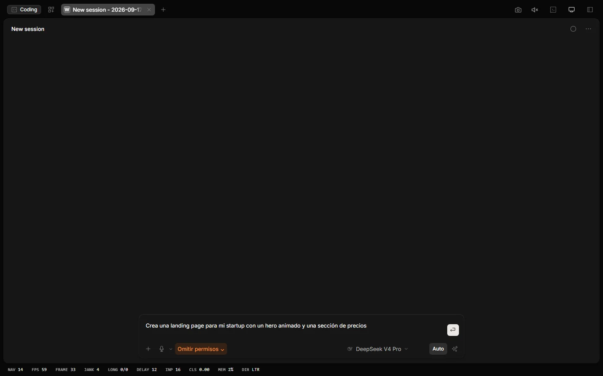
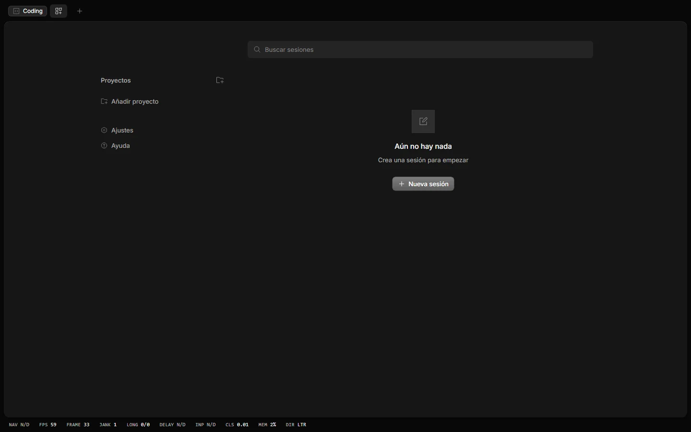
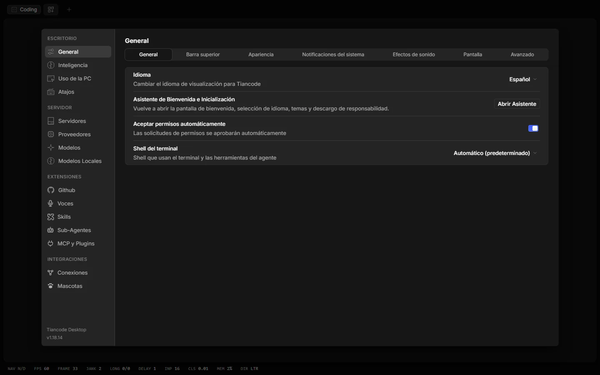
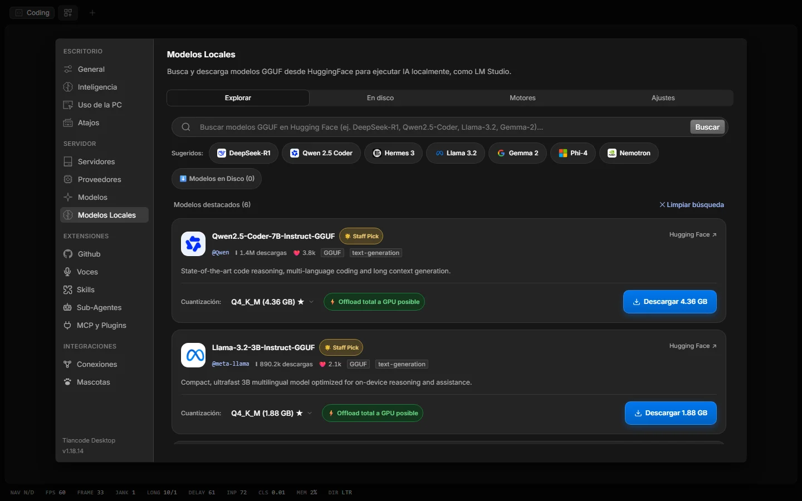
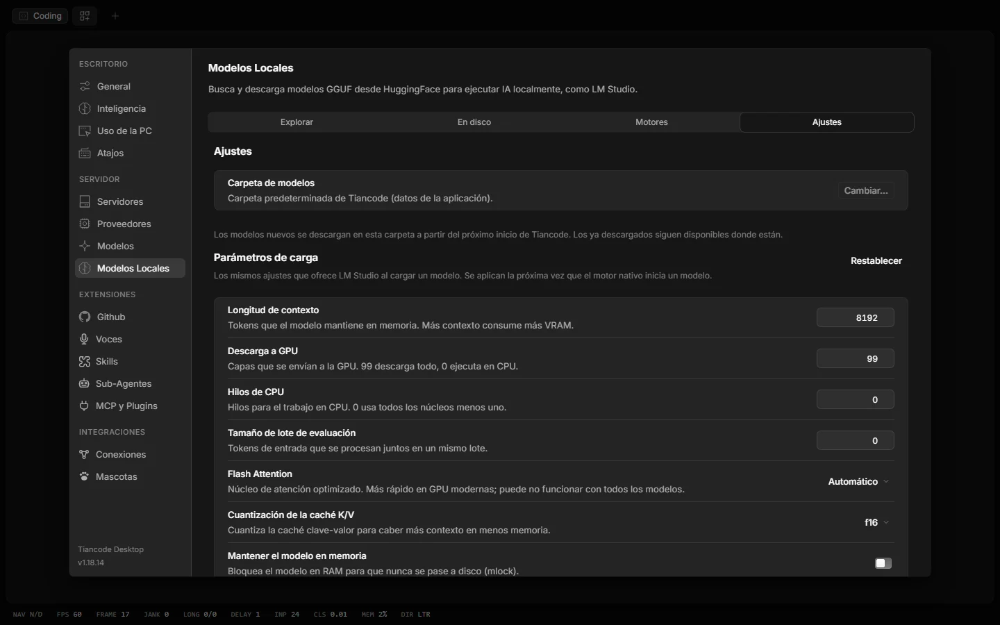
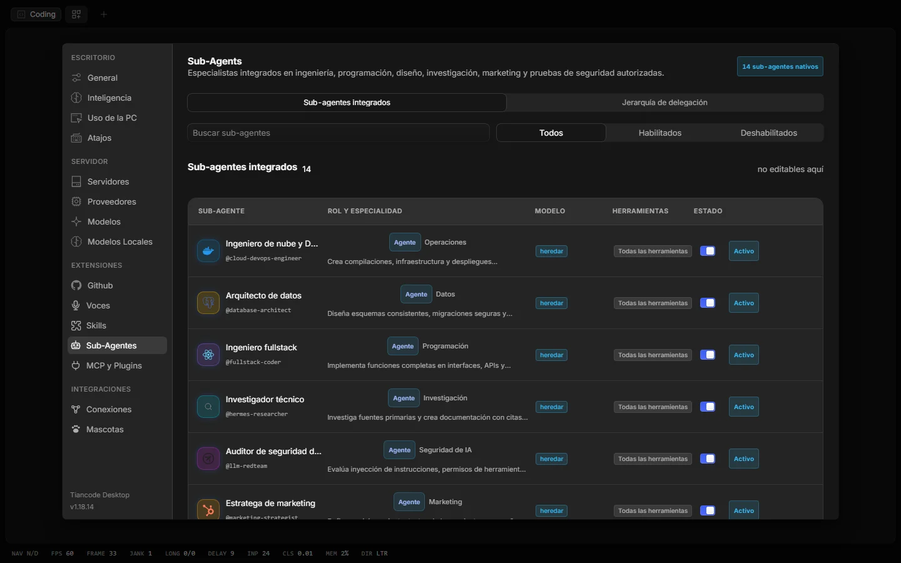
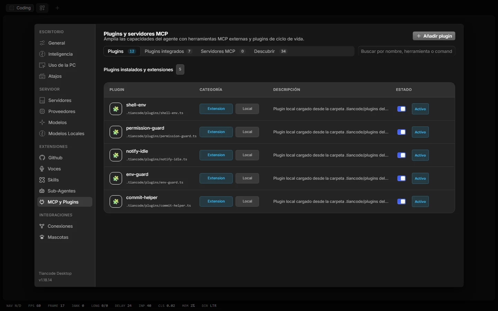
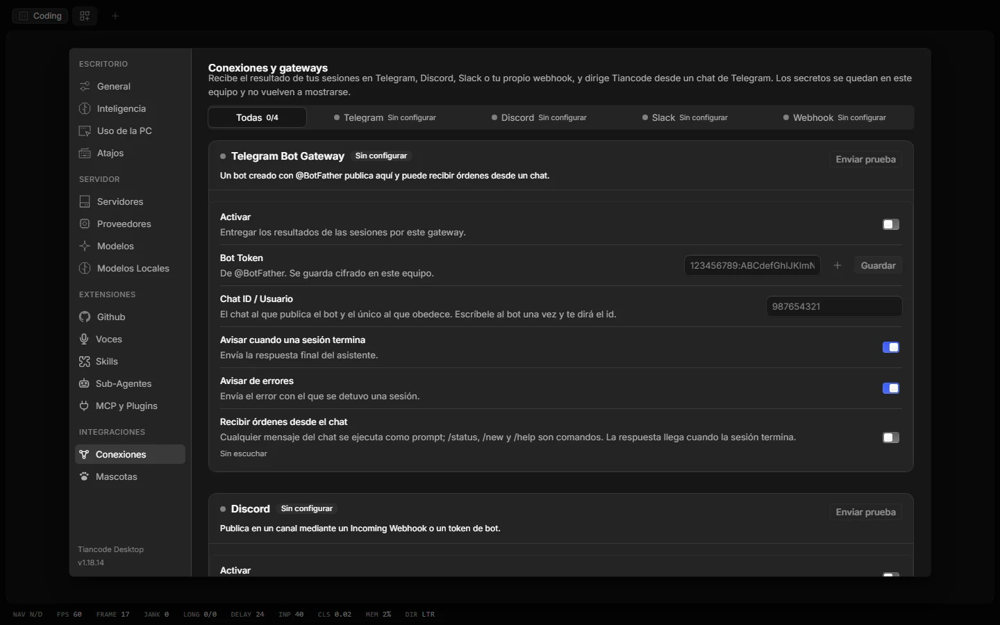
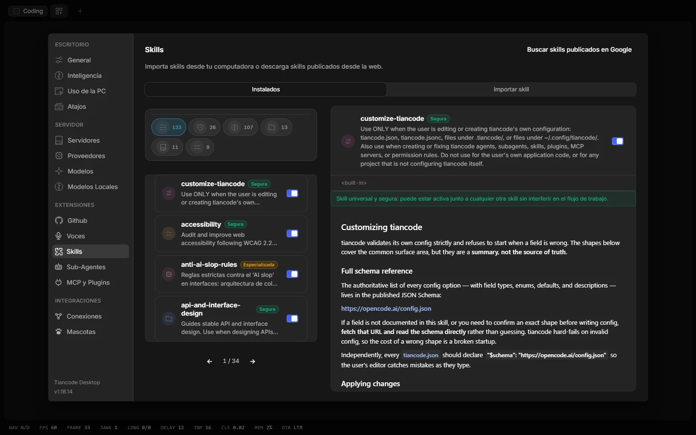

<p align="center">
  <picture>
    <source media="(prefers-color-scheme: dark)" srcset="frontend/icons/tian-white.png">
    <source media="(prefers-color-scheme: light)" srcset="frontend/icons/tian-black.png">
    
  </picture>
</p>

<h1 align="center">Tiancode</h1>

<p align="center">
  <strong>Inteligencia agéntica local-first para programar.</strong><br>
  App de escritorio para Windows y CLI para Windows, macOS y Linux. Tu máquina es el motor: modelos GGUF locales o el proveedor que elijas, catorce especialistas, vista previa en vivo, voz, MCP y una mascota que te cuenta qué está haciendo el agente.
</p>

<p align="center">
  <a href="README.md">Español</a> · <a href="README.en.md">English</a> · <a href="https://tiancode.vercel.app/">Sitio web</a> · <a href="https://github.com/Dreftian/Tiancode/releases/latest">Última versión</a> · <a href="CHANGELOG.md">Cambios</a>
</p>

<p align="center">
  <a href="https://github.com/Dreftian/Tiancode/releases/latest"></a>
  <a href="https://www.npmjs.com/package/tiancode-ai"></a>
  <a href="https://github.com/Dreftian/Tiancode/releases"></a>
  <a href="LICENSE"></a>
  <a href="https://github.com/Dreftian/Tiancode/stargazers"></a>
</p>

<p align="center">
  
  
  
  
  
  
  
  
  
  
  <a href="https://github.com/Dreftian/Tiancode/commits/dev"></a>
</p>

<p align="center">
  <a href="https://github.com/Dreftian/Tiancode/releases/latest/download/Tiancode.exe"></a>
  &nbsp;
  <a href="https://github.com/Dreftian/Tiancode/releases/latest/download/Tiancode-portable.exe"></a>
  &nbsp;
  <a href="#instalar-el-cli-windows-macos-y-linux"></a>
</p>

<p align="center">
  
</p>

---

## Tabla de contenidos

- [Qué es Tiancode](#qué-es-tiancode)
- [Características](#características)
- [Capturas](#capturas)
- [Plataformas](#plataformas)
- [Inicio rápido](#inicio-rápido)
- [Instalar la app de escritorio (Windows)](#instalar-la-app-de-escritorio-windows)
- [Instalar el CLI (Windows, macOS y Linux)](#instalar-el-cli-windows-macos-y-linux)
- [Usar el CLI](#usar-el-cli)
- [Configuración](#configuración)
- [Arquitectura](#arquitectura)
- [Desarrollo](#desarrollo)
- [Hoja de ruta](#hoja-de-ruta)
- [Contribuir](#contribuir)
- [Seguridad y privacidad](#seguridad-y-privacidad)
- [Preguntas frecuentes](#preguntas-frecuentes)
- [Créditos y licencia](#créditos-y-licencia)

## Qué es Tiancode

Tiancode es un fork de escritorio de [OpenCode](https://github.com/sst/opencode) desarrollado por ZenithAI. La app para Windows envuelve el servidor y la interfaz en una ventana nativa con bandeja del sistema, mascota de escritorio, vista previa y actualizador; el CLI lleva el mismo motor a la terminal de Windows, macOS y Linux.

Todo vive en tu equipo: las sesiones, la memoria del agente y las skills aprendidas se guardan en SQLite; los modelos GGUF se ejecutan con el motor nativo (llama.cpp), Ollama o LM Studio; y cualquier proveedor en la nube se conecta con su propia clave, que nunca sale de tu máquina salvo hacia ese proveedor.

## Características

| | |
|---|---|
| **Chat al estilo Claude Code** | Envío dentro del cuadro, modos de permiso (Auto, Manual, Aceptar ediciones, Plan, Omitir permisos) que cambian en plena tarea y un control deslizante de esfuerzo con un color por nivel. |
| **Catorce especialistas** | Sub-agentes de nube, datos, fullstack, investigación, seguridad de IA, marketing y más, con jerarquía de delegación, herramientas acotadas y sus instrucciones visibles en Ajustes. |
| **Modelos locales** | Explorador de Hugging Face con tamaños reales por cuantización, pestaña «En disco» con los GGUF que tienes de verdad y **configuración de carga automática** por modelo (contexto, capas en GPU, hilos, lote y caché KV calculados con tu VRAM y RAM), además de los mismos parámetros manuales que LM Studio. |
| **Vista previa en vivo** | Detecta Vite, Next, Astro, Remix, SvelteKit, SolidStart, Qwik, Expo, Eleventy, Parcel, webpack y más; se abre sola solo cuando el agente arranca una app web. |
| **Voz** | Dictado con Whisper ONNX y lectura de respuestas con Kokoro o Piper en español, sin conexión. |
| **MCP y plugins** | Servidores MCP locales (stdio) o remotos (HTTP/SSE), plugins npm o locales y un catálogo para descubrir más, con detalle real de transporte, variables y herramientas. |
| **Conexiones** | Recibe los resultados en Telegram, Discord, Slack o un webhook y dirige Tiancode desde un chat. |
| **Mascotas** | Un compañero ilustrado que refleja el estado de la sesión, dentro de la app, flotando en el escritorio de Windows o en ambos. |
| **CLI** | Interfaz de terminal, servidor headless, interfaz web, sesiones, exportación e importación, estadísticas de tokens y gestión de proveedores, agentes, MCP y plugins. |

## Capturas

| Inicio | Ajustes |
|---|---|
|  |  |
| **Modelos locales** | **Parámetros de carga** |
|  |  |
| **Sub-agentes** | **MCP y plugins** |
|  |  |
| **Conexiones** | **Skills** |
|  |  |

## Plataformas

| | Windows 10 / 11 (x64) | macOS (Apple Silicon e Intel) | Linux (x64 y arm64) |
|---|:---:|:---:|:---:|
| **App de escritorio** (Electron: bandeja, mascota, vista previa, actualizador) | ✅ instalador y portable | 🔜 en preparación | 🔜 en preparación |
| **Tiancode CLI** (interfaz de terminal, servidor headless y web) | ✅ | ✅ | ✅ |

`tiancode web` abre en el navegador la misma interfaz de la app de escritorio, en cualquier sistema.

## Inicio rápido

**Escritorio (Windows)**

```text
1. Descarga Tiancode.exe y ábrelo.
2. El asistente de bienvenida pide idioma, tema, mascota y voz.
3. Conecta un proveedor en Ajustes › Proveedores o descarga un modelo en Modelos locales.
4. Elige una carpeta (o chatea sin proyecto) y escribe tu primera petición.
```

**Terminal (Windows, macOS y Linux)**

```bash
curl -fsSL https://tiancode.vercel.app/install | bash   # macOS y Linux
tiancode providers login                                  # guarda la clave de un proveedor
tiancode                                                  # interfaz de terminal en la carpeta actual
```

## Instalar la app de escritorio (Windows)

1. Descarga [`Tiancode.exe`](https://github.com/Dreftian/Tiancode/releases/latest/download/Tiancode.exe) (instalador) o [`Tiancode-portable.exe`](https://github.com/Dreftian/Tiancode/releases/latest/download/Tiancode-portable.exe) (sin instalación, ideal para USB).
2. Ábrelo: el asistente de bienvenida configura idioma, tema, mascota y voz en una sola tarjeta.
3. Conecta un proveedor en **Ajustes › Proveedores** o descarga un modelo en **Modelos locales**, y empieza a chatear.

Requisitos: Windows 10 u 11 de 64 bits. Para modelos locales, una GPU con Vulkan o la CPU; el motor nativo se descarga la primera vez.

Cada release incluye `Tiancode.exe`, `Tiancode-portable.exe`, `Tiancode.exe.blockmap` y `latest.yml` con sus SHA-512. El actualizador integrado usa `latest.yml` y conserva claves, sesiones y configuración.

## Instalar el CLI (Windows, macOS y Linux)

Un solo binario, sin Node ni Bun. Los archivos `tiancode-<sistema>-<arquitectura>` de cada release traen su `SHA256SUMS.txt`.

```bash
# macOS y Linux
curl -fsSL https://tiancode.vercel.app/install | bash
```

```powershell
# Windows (PowerShell)
irm https://tiancode.vercel.app/install.ps1 | iex
```

| Gestor | Comando | Estado |
|---|---|---|
| npm | `npm install -g tiancode-ai` | ✅ |
| bun | `bun install -g tiancode-ai` | ✅ |
| Homebrew | `brew install Dreftian/tap/tiancode` | ✅ macOS y Linux |
| Arch Linux (AUR) | `paru -S tiancode-bin` | 🔜 en preparación; usa `curl` mientras tanto |

Variables opcionales de los instaladores: `TIANCODE_VERSION` fija una versión concreta y `TIANCODE_INSTALL_DIR` cambia la carpeta (por defecto `~/.tiancode/bin` o `%LOCALAPPDATA%\Programs\tiancode\bin`).

## Usar el CLI

```bash
tiancode [carpeta]          # interfaz de terminal (TUI) en la carpeta indicada o la actual
tiancode run "..."          # una petición directa; --continue retoma la última sesión
tiancode web                # servidor + interfaz web en el navegador
tiancode serve              # servidor headless para la app, la web u otros clientes
tiancode attach <url>       # conecta la TUI a un servidor en marcha
tiancode providers          # proveedores y credenciales (alias: auth)
tiancode models [proveedor] # modelos disponibles
tiancode agent              # sub-agentes
tiancode mcp                # servidores MCP
tiancode plugin <paquete>   # instala un plugin y actualiza la configuración
tiancode session            # sesiones; export / import las mueven entre equipos
tiancode stats              # uso de tokens y coste
tiancode github             # agente de GitHub;  tiancode pr <n> abre una PR y arranca la TUI
tiancode upgrade            # actualiza a la última versión o a una concreta
tiancode --help             # todas las opciones (--model, --agent, --port, --pure, --auto…)
```

Opciones útiles: `-m proveedor/modelo` elige el modelo, `--agent` el especialista, `--port` y `--hostname` exponen el servidor, `--pure` arranca sin plugins externos y `--auto` aprueba los permisos no denegados explícitamente (úsalo con cuidado).

## Configuración

- **Global:** `~/.config/tiancode/tiancode.json` (o `.jsonc`) guarda proveedores, modelo por defecto, tema, agentes, MCP y plugins.
- **Por proyecto:** un `tiancode.json` o `tiancode.jsonc` en la raíz del repositorio (o en `.tiancode/`) se fusiona sobre la configuración global.
- **Servidor:** con `tiancode serve` o `tiancode web` fuera de tu máquina, define `TIANCODE_SERVER_PASSWORD` para exigir autenticación HTTP básica.
- **App de escritorio:** los datos viven en `%APPDATA%\ai.tiancode.desktop.release` (instalador) o junto al ejecutable (portable); los respaldos se gestionan desde **Ajustes › General**.

## Arquitectura

```text
frontend/
  app/          Interfaz SolidJS: chat, ajustes, vista previa, modelos locales
  desktop/      Electron: ventana, bandeja, mascota de escritorio, voz, actualizador
  session-ui/   Componentes de sesión y visor de documentos
  ui/           Sistema de diseño, temas y mascotas ilustradas
  website/      Sitio web (portada astral, universo de paneles e instaladores)
backend/
  tiancode/     Servidor y CLI: agentes, herramientas, MCP, model hub, motor local, preview
  core/         Datos: SQLite, sesiones, configuración
  sdk/          SDK TypeScript
skills/         Skills integradas
tools/          Scripts de release (app, CLI, npm, Homebrew, web) y notas de versión
```

La app de escritorio y el CLI comparten el mismo servidor (Bun + Effect). La interfaz web se sirve embebida en el binario, por lo que `tiancode web` no necesita nada más instalado.

## Desarrollo

```bash
git clone https://github.com/Dreftian/Tiancode.git
cd Tiancode
bun install

# App de escritorio (Electron + SolidJS)
cd frontend/desktop && bun run dev

# Servidor y CLI (Bun + Effect)
cd backend/tiancode && bun dev
```

Comprobaciones: `bun typecheck` en la raíz; pruebas por paquete (`bun run test:unit` en `frontend/app`, `bun test src/main` en `frontend/desktop`, `bun run test` en `frontend/session-ui`, `bun test test/<carpeta>` en `backend/tiancode`).

Empaquetado: `TIANCODE_CHANNEL=prod bun run --cwd frontend/desktop package:win` genera la app; `bun tools/script/build-cli.ts --version X.Y.Z` compila el CLI para las cinco plataformas y empaqueta los archivos de la release.

## Hoja de ruta

- [x] App de escritorio para Windows (instalador y portable)
- [x] CLI para Windows, macOS y Linux con instaladores `curl`/PowerShell, npm, bun y Homebrew
- [ ] App de escritorio para macOS y Linux
- [ ] Paquete en AUR (`tiancode-bin`)
- [ ] Firma de código de los ejecutables de Windows y macOS

## Contribuir

Las contribuciones son bienvenidas: errores, mejoras de rendimiento, nuevos proveedores, documentación y traducciones. Lee [CONTRIBUTING.md](CONTRIBUTING.md) antes de abrir una PR y usa las plantillas de [issues](https://github.com/Dreftian/Tiancode/issues/new/choose).

## Seguridad y privacidad

Tiancode no aísla al agente: el sistema de permisos te avisa antes de ejecutar comandos o escribir archivos, pero no es un sandbox. El servidor local escucha en `127.0.0.1`, rechaza peticiones con una cabecera `Host` ajena (protección contra DNS rebinding), añade cabeceras de seguridad y bloquea temporalmente una dirección tras diez contraseñas fallidas; la app de escritorio protege su servidor con una contraseña aleatoria por sesión. Si necesitas aislamiento real, ejecútalo dentro de un contenedor o una máquina virtual. Consulta [SECURITY.md](SECURITY.md) para el modelo de amenazas y cómo reportar una vulnerabilidad.

## Preguntas frecuentes

**¿Necesito una clave de API?** No. Puedes descargar un modelo GGUF en **Modelos locales** y trabajar sin conexión. Los proveedores en la nube son opcionales.

**¿Funciona en macOS o Linux?** El CLI sí, con `tiancode web` para la misma interfaz en el navegador. La app de escritorio nativa está en preparación.

**¿La actualización borra mis datos?** No. El actualizador conserva claves, sesiones, configuración y respaldos.

**¿Dónde están mis sesiones?** En una base de datos SQLite dentro del perfil de la app; se exportan e importan con `tiancode session export` e `import`.

## Créditos y licencia

Basado en [OpenCode](https://github.com/sst/opencode). Mascotas ilustradas de [page-mascot](https://github.com/nilbuild/page-mascot) (MIT © Kamran Ahmed). Motor local: [llama.cpp](https://github.com/ggml-org/llama.cpp).

MIT. Consulta [LICENSE](LICENSE).

<p align="center">
  <a href="https://star-history.com/#Dreftian/Tiancode&Date"></a>
</p>

<p align="center">Hecho con ♥ por <a href="https://github.com/Dreftian">Dreftian</a> · ZenithAI</p>
