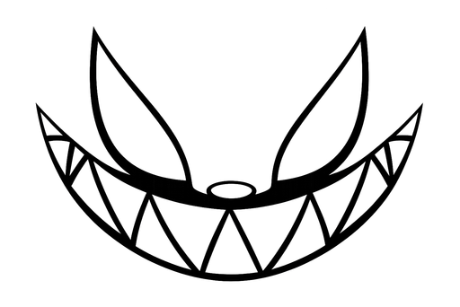

<div align="center">

<picture>
  <source media="(prefers-color-scheme: dark)" srcset="img/tian-white.png">
  
</picture>

# Tiancode · Sitio web oficial

**Landing page oficial de Tiancode** — el asistente de IA local-first para programar en Windows. Estática, sin dependencias y lista para desplegar en cualquier host.

[](https://vercel.com/new/clone?repository-url=https%3A%2F%2Fgithub.com%2FDreftian%2FTiancode)
[](LICENSE)
[](#)
[](#)
[](#)
[](https://github.com/Dreftian/Tiancode/commits/main)

</div>

## ✨ Acerca de

Este repositorio contiene **solo el sitio web** de Tiancode: la landing que presenta la aplicación, sus características, descargas, documentación y páginas legales.

- **Sin framework ni build**: HTML, CSS y JavaScript vanilla. Un servidor estático es suficiente.
- **Bilingüe**: español e inglés con selector persistente (`js/i18n.js`).
- **Tema claro/oscuro** automático (`js/theme.js`).
- **Responsive** y accesible, con animaciones ligeras (`js/animations.js`).

## 📄 Páginas

| Ruta | Contenido |
|---|---|
| [`/`](index.html) | Portada: hero, características, cómo funciona, preview, skills y estadísticas |
| [`/recursos/docs.html`](recursos/docs.html) | Documentación |
| [`/recursos/guia.html`](recursos/guia.html) | Guía de inicio |
| [`/recursos/faq.html`](recursos/faq.html) | Preguntas frecuentes |
| [`/recursos/descargas.html`](recursos/descargas.html) | Descargas del instalador y portable |
| [`/recursos/novedades.html`](recursos/novedades.html) | Novedades y changelog |
| [`/recursos/portable.html`](recursos/portable.html) | Guía de la versión portable |
| [`/productos/app.html`](productos/app.html) | Página de producto |
| [`/legal/privacidad.html`](legal/privacidad.html) · [`terminos.html`](legal/terminos.html) · [`licencia.html`](legal/licencia.html) | Política de privacidad, términos y licencia |

## 🚀 Despliegue

### Vercel (recomendado)

1. Pulsa el botón **Deploy** de arriba o entra en [vercel.com/new](https://vercel.com/new) e importa el repositorio `Dreftian/Tiancode`.
2. Vercel detecta el sitio estático automáticamente (framework preset: **Other**, sin build command, output en la raíz).
3. Cada push a `main` publica una nueva versión.

### GitHub Pages

1. Repositorio → **Settings → Pages**.
2. **Source**: *Deploy from a branch* → `main` → `/ (root)`.
3. El sitio queda disponible en `https://dreftian.github.io/Tiancode/`.

### Netlify

1. [app.netlify.com](https://app.netlify.com) → **Add new site → Import an existing project**.
2. Selecciona el repositorio, con build command vacío y publish directory en la raíz (`/`).

## 🛠️ Desarrollo local

Solo necesitas cualquier servidor estático:

```bash
# Python
python -m http.server 8000

# Node
npx serve .

# Bun
bunx serve .
```

Abre [`http://localhost:8000`](http://localhost:8000) en tu navegador.

## 🎨 Personalización

La web está organizada para editarse sin herramientas:

```
css/
  tokens.css       # Variables de diseño: colores, tipografías, radios
  layout.css       # Estructura y grid
  components.css   # Botones, tarjetas, navegación
  pages.css        # Estilos de páginas interiores
js/
  i18n.js          # Textos es/en y persistencia del idioma
  theme.js         # Tema claro/oscuro
  router.js        # Navegación
  animations.js    # Animaciones de entrada (reveal)
  charts.js        # Gráficos de la portada
  faq.js           # Acordeones de preguntas frecuentes
img/               # Logotipos, favicon, iconos PWA e imagen OG
```

### Infraestructura

| Archivo | Propósito |
|---|---|
| `vercel.json` | Headers de seguridad, caché y redirects (Vercel) |
| `robots.txt` · `sitemap.xml` | Indexación y SEO |
| `404.html` | Página 404 con la marca |
| `site.webmanifest` | Manifest PWA (instalable) |
| `img/og-image.png` | Preview al compartir en redes/mensajeros |

- Cambia colores, tipografía y radios en `css/tokens.css`.
- Añade o traduce textos en `js/i18n.js`.
- Cada página interior comparte la misma estructura (`<header>`, `<nav>`, `<main>`, `<footer>`), así que las plantillas de `recursos/` y `legal/` sirven de referencia para nuevas páginas.

## ⬇️ Descargas de la app

Los botones de descarga de la web apuntan a los assets publicados en [GitHub Releases](https://github.com/Dreftian/Tiancode/releases):

| Binario | Uso |
|---|---|
| `Tiancode.exe` | Instalador para Windows 10/11 (NSIS) |
| `Tiancode-portable.exe` | Versión portable (sin instalación) |

## 📄 Licencia

MIT — ver [LICENSE](LICENSE).

---

Hecho con ♥ — [Tiancode](https://github.com/Dreftian/Tiancode)
