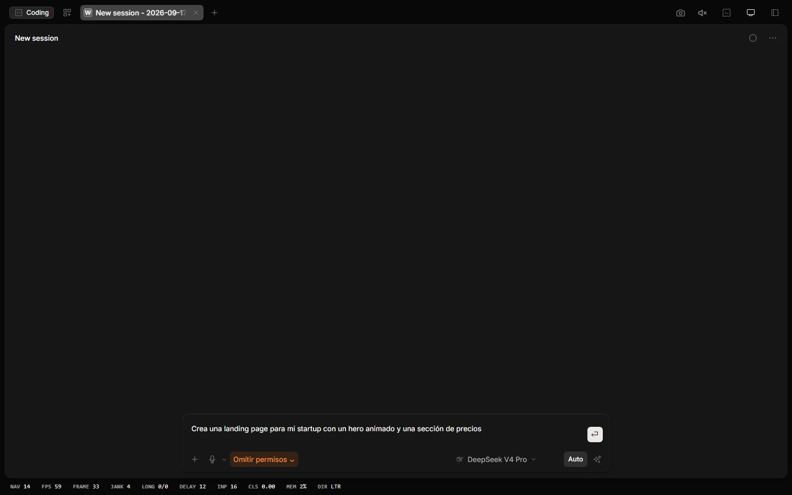
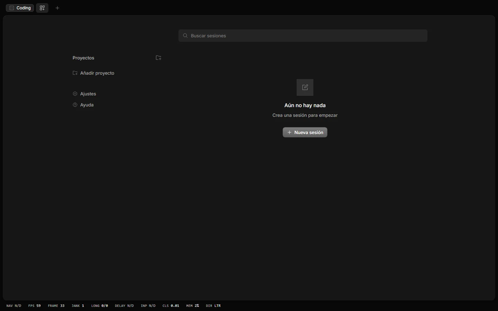
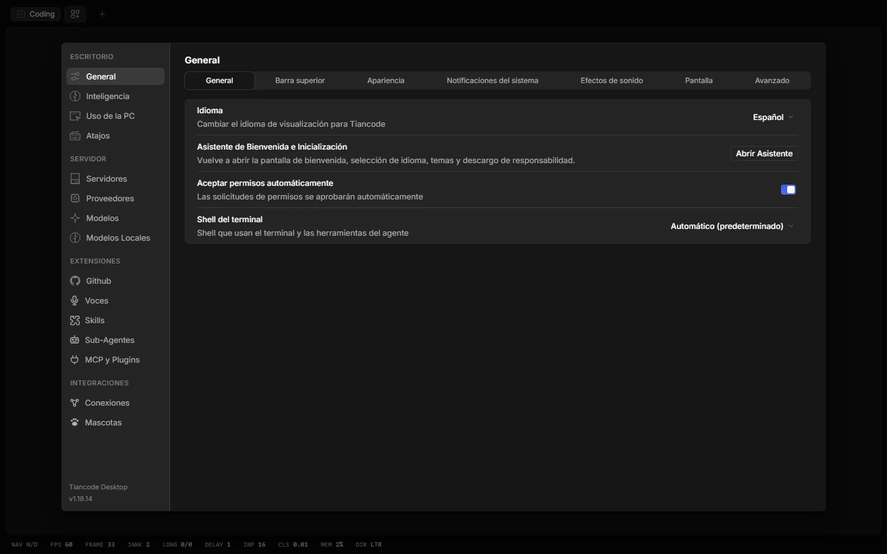
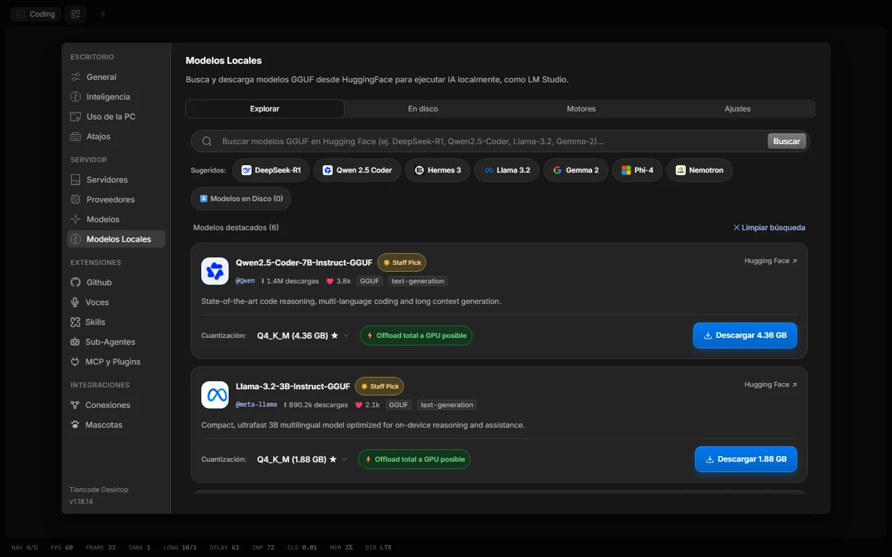
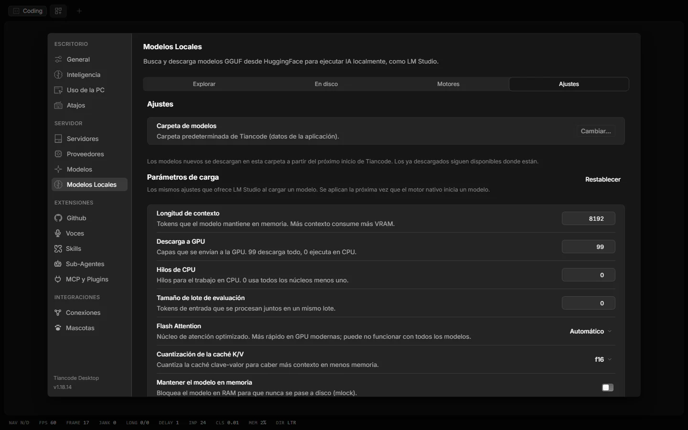
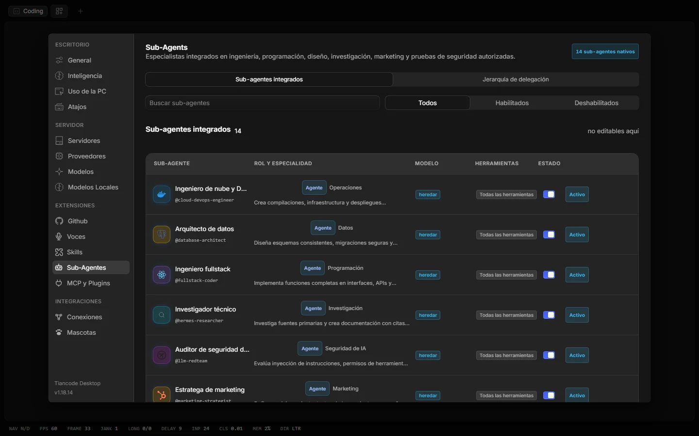
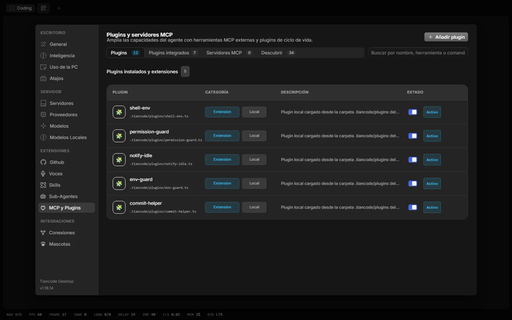
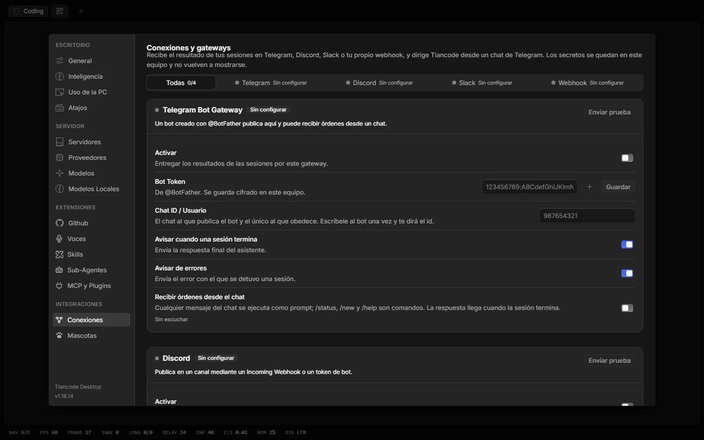
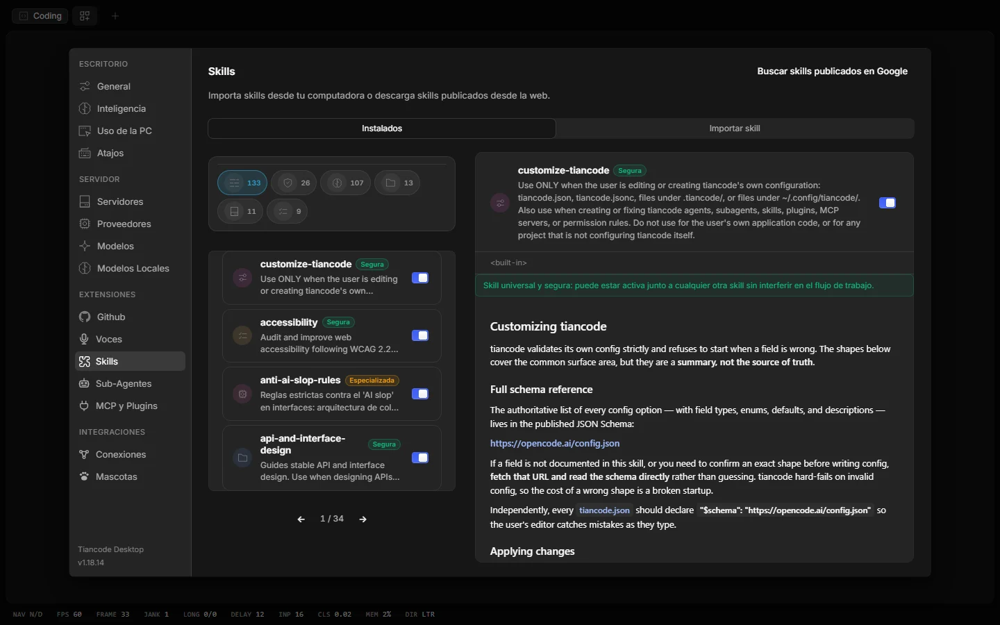

<p align="center">
  <picture>
    <source media="(prefers-color-scheme: dark)" srcset="frontend/icons/readme/hero-dark.svg">
    <source media="(prefers-color-scheme: light)" srcset="frontend/icons/readme/hero-light.svg">
    
  </picture>
</p>

<p align="center">
  <strong>App de escritorio para Windows y CLI para Windows, macOS y Linux.</strong><br>
  Tu máquina es el motor: modelos GGUF locales, los modelos gratuitos de OpenCode o el proveedor que elijas, catorce especialistas, vista previa en vivo, uso visual de Windows, miles de extensiones y una mascota que te cuenta qué está haciendo el agente.
</p>

<p align="center">
  <a href="README.md">Español</a> · <a href="README.en.md">English</a> · <a href="https://tiancode.vercel.app/">Sitio web</a> · <a href="https://github.com/Dreftian/Tiancode/releases/latest">Última versión</a> · <a href="CHANGELOG.md">Cambios</a>
</p>

<p align="center">
  <a href="https://github.com/Dreftian/Tiancode/releases/latest"></a>
  <a href="https://github.com/Dreftian/Tiancode/releases"></a>
  <a href="LICENSE"></a>
  <a href="https://github.com/Dreftian/Tiancode/stargazers"></a>
</p>

<p align="center">
  
  
  
  
  
  
  
  
  
  <a href="https://github.com/Dreftian/Tiancode/commits/dev"></a>
</p>

<p align="center">
  <a href="https://github.com/Dreftian/Tiancode/releases/latest/download/Tiancode.exe"></a>
  &nbsp;
  <a href="https://github.com/Dreftian/Tiancode/releases/latest/download/Tiancode-portable.exe"></a>
  &nbsp;
  <a href="#instalar-el-cli-windows-macos-y-linux"></a>
</p>

<p align="center">
  
</p>

<p align="center"></p>

## Tabla de contenidos

- [Novedades de la 1.0.0](#novedades-de-la-100)
- [Qué es Tiancode](#qué-es-tiancode)
- [Características](#características)
- [Capturas](#capturas)
- [Plataformas](#plataformas)
- [Inicio rápido](#inicio-rápido)
- [Instalar la app de escritorio (Windows)](#instalar-la-app-de-escritorio-windows)
- [Instalar el CLI (Windows, macOS y Linux)](#instalar-el-cli-windows-macos-y-linux)
- [Usar el CLI](#usar-el-cli)
- [Configuración](#configuración)
- [Arquitectura](#arquitectura)
- [Desarrollo](#desarrollo)
- [Hoja de ruta](#hoja-de-ruta)
- [Contribuir](#contribuir)
- [Seguridad y privacidad](#seguridad-y-privacidad)
- [Preguntas frecuentes](#preguntas-frecuentes)
- [Créditos y licencia](#créditos-y-licencia)

## Novedades de la 1.0.0

La numeración vuelve a empezar en 1.0.0 e incluye todo lo publicado hasta ahora.

- 🆓 **Modelos gratuitos de OpenCode.** El grupo «OpenCode Free» (Big Pickle, Exo, Fledge Alpha, Ling, LongCat, MiMo, Muse Spark, Nemotron, Space Bunny…) se activa en **Ajustes › Proveedores**, **Ajustes › Modelos** o la bienvenida, con un interruptor por modelo. La lista sigue el catálogo de OpenCode y se actualiza cada hora.
- 🧭 **Bienvenida de 1200×850.** Seis pasos: idioma y tema; escala de la interfaz y tamaño de la conversación con vista previa; pestañas, terminal y vista previa; línea de tiempo; modelos gratuitos; y qué se abre al iniciar.
- 🐱 **Mascota en el chat.** Aparece junto a Pensando, Explorando, Editar, Shell, preguntas y sub-agentes, con la expresión de lo que hace el modelo.
- 🪟 **Vista previa que se cierra.** Cerrar el Sandbox ya no lo vuelve a abrir en bucle, ni con una web ni con una app.
- 🚀 **Code al abrir.** El modo Code continúa en tu último proyecto y solo pide una carpeta la primera vez.
- ⌨️ **CLI más claro.** `tiancode run` avisa de los reintentos del proveedor y se detiene con el motivo si la espera es larga.

[Lista completa de cambios](CHANGELOG.md)

## Qué es Tiancode

Tiancode es un fork de escritorio de [OpenCode](https://github.com/sst/opencode) desarrollado por ZenithAI. La app para Windows envuelve el servidor y la interfaz en una ventana nativa con bandeja del sistema, mascota, vista previa y actualizador; el CLI lleva el mismo motor a la terminal de Windows, macOS y Linux.

Todo vive en tu equipo: las sesiones, la memoria del agente y las skills aprendidas se guardan en SQLite; los modelos GGUF se ejecutan con el motor nativo (llama.cpp), Ollama o LM Studio; y cualquier proveedor en la nube se conecta con su propia clave, que nunca sale de tu máquina salvo hacia ese proveedor.

<p align="center"></p>

## Características

<table>
  <tr>
    <td width="50%" valign="top"><h3>💬 Chat al estilo Claude Code</h3>Modos de permiso Auto, Manual, Aceptar ediciones, Plan y Omitir permisos que cambian en plena tarea, esfuerzo con control deslizante hasta Ultracode, mensajes en cola editables y resumen de sesión.</td>
    <td width="50%" valign="top"><h3>🆓 Modelos gratuitos de OpenCode</h3>«OpenCode Free» con un interruptor general y otro por modelo; la lista sigue el catálogo de OpenCode. Con tu clave de OpenCode Zen tienes además todos sus modelos de pago.</td>
  </tr>
  <tr>
    <td valign="top"><h3>🦙 Modelos locales GGUF</h3>Explorador de Hugging Face con el tamaño real de cada cuantización, pestaña «En disco» y carga automática según tu VRAM y RAM. Ollama y LM Studio se usan si están en marcha.</td>
    <td valign="top"><h3>🧩 Descubrir</h3>Unas 3600 extensiones: plugins de Claude Code y Codex, skills y servidores MCP de varios registros. Se instalan con un clic, sin pisar tus nombres, y desinstalar quita exactamente lo añadido.</td>
  </tr>
  <tr>
    <td valign="top"><h3>🔌 Conectores</h3>Cerca de 300 apps con su logo real. Conectar añade el servidor MCP de la app y abre su inicio de sesión en el navegador.</td>
    <td valign="top"><h3>🖥️ Uso visual de Windows</h3>El modelo observa capturas y el contexto de UI Automation, hace clic, arrastra y escribe. Una luz azul indica el control activo y «Detener ahora» lo corta al momento.</td>
  </tr>
  <tr>
    <td valign="top"><h3>👀 Sandbox y vista en vivo</h3>El agente arranca, reinicia y revisa el servidor de tu app (Vite, Next, Astro, Remix, SvelteKit, Expo…), inspecciona la página aislada y el modo diseño manda un elemento al chat.</td>
    <td valign="top"><h3>🤖 Catorce especialistas</h3>Sub-agentes por categorías, cada uno con su modelo, temperatura, pasos, permisos por herramienta, instrucciones y color editables.</td>
  </tr>
  <tr>
    <td valign="top"><h3>🛡️ Inteligencia y protección</h3>Memoria del usuario y del proyecto, CodeGraph, compactación y poda del contexto, AgentShield para comandos críticos y decisiones locales sin conexión.</td>
    <td valign="top"><h3>🎙️ Voz</h3>Dictado con Whisper en tu equipo y lectura de respuestas con Kokoro, Piper o Fish Audio, eligiendo la voz según el idioma de cada texto.</td>
  </tr>
  <tr>
    <td valign="top"><h3>🐱 Mascotas</h3>Doce personajes animados: junto a cada paso del chat y, si quieres, flotando en el escritorio de Windows.</td>
    <td valign="top"><h3>📣 Avisos y emparejamiento</h3>Avisos de fin de tarea en Telegram, Discord, Slack o un webhook, y un código QR para abrir Tiancode desde otro dispositivo de tu red.</td>
  </tr>
  <tr>
    <td valign="top"><h3>🐙 GitHub</h3>Explora, clona y crea repositorios y haz commits desde Conexiones; en el CLI, <code>tiancode github</code> y <code>tiancode pr</code>.</td>
    <td valign="top"><h3>⌨️ CLI multiplataforma</h3>Interfaz de terminal, <code>run</code>, <code>serve</code>, <code>web</code>, <code>attach</code>, ACP para editores, sesiones, estadísticas y gestión de proveedores, MCP y plugins.</td>
  </tr>
</table>

## Capturas

| Inicio | Ajustes |
|---|---|
|  |  |
| **Modelos Locales** | **Parámetros de carga** |
|  |  |
| **Sub-agentes** | **MCP y plugins** |
|  |  |
| **Conexiones** | **Skills** |
|  |  |

## Plataformas

| | Windows 10 / 11 (x64) | macOS (Apple Silicon e Intel) | Linux (x64 y arm64) |
|---|:---:|:---:|:---:|
| **App de escritorio** (Electron: bandeja, mascota, vista previa, actualizador) | ✅ instalador y portable | 🔜 en preparación | 🔜 en preparación |
| **Tiancode CLI** (interfaz de terminal, servidor headless y web) | ✅ | ✅ | ✅ |

`tiancode web` abre en el navegador la misma interfaz de la app de escritorio, en cualquier sistema.

## Inicio rápido

**Escritorio (Windows)**

```text
1. Descarga Tiancode.exe y ábrelo.
2. La bienvenida configura idioma, tema, escala, conversación, pestañas, línea de tiempo y modelos.
3. Activa los modelos gratuitos, conecta un proveedor en Ajustes › Proveedores o descarga un modelo local.
4. Elige una carpeta (o chatea sin proyecto) y escribe tu primera petición.
```

**Terminal (Windows, macOS y Linux)**

```bash
curl -fsSL https://tiancode.vercel.app/install | bash   # macOS y Linux
tiancode providers login                                  # guarda la clave de un proveedor
tiancode                                                  # interfaz de terminal en la carpeta actual
```

## Instalar la app de escritorio (Windows)

1. Descarga [`Tiancode.exe`](https://github.com/Dreftian/Tiancode/releases/latest/download/Tiancode.exe) (instalador) o [`Tiancode-portable.exe`](https://github.com/Dreftian/Tiancode/releases/latest/download/Tiancode-portable.exe) (sin instalación, ideal para USB).
2. Ábrelo: la bienvenida de seis pasos lo deja listo en un minuto.
3. Activa los modelos gratuitos, conecta un proveedor en **Ajustes › Proveedores** o descarga un modelo en **Modelos Locales**, y empieza a chatear.

Requisitos: Windows 10 u 11 de 64 bits. Para modelos locales, una GPU con Vulkan o la CPU; el motor nativo se descarga la primera vez.

Cada release incluye `Tiancode.exe`, `Tiancode-portable.exe`, `Tiancode.exe.blockmap` y `latest.yml` con sus SHA-512. El actualizador integrado usa `latest.yml` y conserva claves, sesiones y configuración. Si tienes una versión 1.0.1–1.0.8, instala `Tiancode.exe` encima: tus datos se conservan.

## Instalar el CLI (Windows, macOS y Linux)

Un solo binario, sin Node ni Bun. Los archivos `tiancode-<sistema>-<arquitectura>` de cada release traen su `SHA256SUMS.txt`.

<p align="center">
  
</p>

```bash
# macOS y Linux
curl -fsSL https://tiancode.vercel.app/install | bash
```

```powershell
# Windows (PowerShell)
irm https://tiancode.vercel.app/install.ps1 | iex
```

| Gestor | Comando | Estado |
|---|---|---|
| Homebrew | `brew install Dreftian/tap/tiancode` | ✅ macOS y Linux, 1.0.0 |
| npm / bun | `npm install -g tiancode-ai` | ⚠️ publicado hasta una versión anterior; para 1.0.0 usa `curl`, PowerShell o Homebrew |
| Arch Linux (AUR) | `paru -S tiancode-bin` | 🔜 en preparación; usa `curl` mientras tanto |

Variables opcionales de los instaladores: `TIANCODE_VERSION` fija una versión concreta y `TIANCODE_INSTALL_DIR` cambia la carpeta (por defecto `~/.tiancode/bin` o `%LOCALAPPDATA%\Programs\tiancode\bin`).

## Usar el CLI

```bash
tiancode [carpeta]          # interfaz de terminal (TUI) en la carpeta indicada o la actual
tiancode run "..."          # una petición directa; --continue retoma la última sesión
tiancode web                # servidor + interfaz web en el navegador
tiancode serve              # servidor headless para la app, la web u otros clientes
tiancode attach <url>       # conecta la TUI a un servidor en marcha
tiancode acp                # Agent Client Protocol para editores compatibles
tiancode providers          # proveedores y credenciales (alias: auth)
tiancode models [proveedor] # modelos disponibles (tiancode models opencode: los gratuitos)
tiancode agent              # sub-agentes
tiancode mcp                # servidores MCP
tiancode plugin <paquete>   # instala un plugin y actualiza la configuración
tiancode session            # sesiones; export / import las mueven entre equipos
tiancode stats              # uso de tokens y coste
tiancode github             # agente de GitHub;  tiancode pr <n> abre una PR y arranca la TUI
tiancode upgrade            # actualiza a la última versión o a una concreta
tiancode --help             # todas las opciones (--model, --agent, --port, --pure, --auto…)
```

Opciones útiles: `-m proveedor/modelo` elige el modelo, `--agent` el especialista, `--port` y `--hostname` exponen el servidor, `--pure` arranca sin plugins externos y `--auto` aprueba los permisos no denegados explícitamente (úsalo con cuidado).

## Configuración

- **Global:** `~/.config/tiancode/tiancode.json` (o `.jsonc`) guarda proveedores, modelo por defecto, tema, agentes, MCP y plugins. `"free_models": true` activa los modelos gratuitos de OpenCode.
- **Por proyecto:** un `tiancode.json` o `tiancode.jsonc` en la raíz del repositorio (o en `.tiancode/`) se fusiona sobre la configuración global.
- **Servidor:** con `tiancode serve` o `tiancode web` fuera de tu máquina, define `TIANCODE_SERVER_PASSWORD` para exigir autenticación HTTP básica.
- **App de escritorio:** los datos viven en `%APPDATA%\ai.tiancode.desktop.release` (instalador de GitHub) o junto al ejecutable (portable). Si el instalador actualiza una instalación anterior cuyos datos están en `%APPDATA%\ai.tiancode.desktop`, sigue usando esa carpeta para conservar sesiones, claves y ajustes; **Ajustes › General › Datos** muestra la carpeta en uso y gestiona los respaldos.

## Arquitectura

```text
frontend/
  app/          Interfaz SolidJS: chat, ajustes, vista previa, modelos locales
  desktop/      Electron: ventana, bandeja, mascota de escritorio, voz, actualizador
  session-ui/   Componentes de sesión y visor de documentos
  ui/           Sistema de diseño, temas y mascotas ilustradas
  website/      Sitio web e instaladores del CLI
backend/
  tiancode/     Servidor y CLI: agentes, herramientas, MCP, model hub, motor local, preview
  core/         Datos: SQLite, sesiones, configuración
  sdk/          SDK TypeScript
skills/         Skills integradas
tools/          Scripts de release (app, CLI, Homebrew, web) y notas de versión
```

La app de escritorio y el CLI comparten el mismo servidor (Bun + Effect). La interfaz web se sirve embebida en el binario, por lo que `tiancode web` no necesita nada más instalado.

## Desarrollo

```bash
git clone https://github.com/Dreftian/Tiancode.git
cd Tiancode
bun install

# App de escritorio (Electron + SolidJS)
cd frontend/desktop && bun run dev

# Servidor y CLI (Bun + Effect)
cd backend/tiancode && bun dev
```

Comprobaciones: `bun typecheck` en cada paquete; pruebas por paquete (`bun run test:unit` y `bun run test:browser` en `frontend/app`, `bun test src/main` en `frontend/desktop`, `bun run test` en `frontend/session-ui`, `bun test test/<carpeta>` en `backend/tiancode`).

Empaquetado: `TIANCODE_CHANNEL=prod bun run --cwd frontend/desktop package:win` genera la app; `bun tools/script/build-cli.ts --version X.Y.Z` compila el CLI para las cinco plataformas. Los banners animados de este README se generan con `python tools/script/readme-banner.py` y `readme-terminal.py`.

## Hoja de ruta

- [x] App de escritorio para Windows (instalador y portable)
- [x] CLI para Windows, macOS y Linux con instaladores `curl`/PowerShell y Homebrew
- [x] Modelos gratuitos de OpenCode con un interruptor por modelo
- [ ] App de escritorio para macOS y Linux
- [ ] Paquete en AUR (`tiancode-bin`)
- [ ] Firma de código de los ejecutables de Windows y macOS

## Contribuir

Las contribuciones son bienvenidas: errores, mejoras de rendimiento, nuevos proveedores, documentación y traducciones. Lee [CONTRIBUTING.md](CONTRIBUTING.md) antes de abrir una PR y usa las plantillas de [issues](https://github.com/Dreftian/Tiancode/issues/new/choose).

## Seguridad y privacidad

Tiancode no aísla al agente: el sistema de permisos te avisa antes de ejecutar comandos o escribir archivos, pero no es un sandbox. El servidor local escucha en `127.0.0.1`, rechaza peticiones con una cabecera `Host` ajena (protección contra DNS rebinding), añade cabeceras de seguridad y bloquea temporalmente una dirección tras diez contraseñas fallidas; la app de escritorio protege su servidor con una contraseña aleatoria por sesión. Si necesitas aislamiento real, ejecútalo dentro de un contenedor o una máquina virtual. Consulta [SECURITY.md](SECURITY.md) para el modelo de amenazas y cómo reportar una vulnerabilidad.

## Preguntas frecuentes

**¿Necesito una clave de API?** No. Puedes activar los modelos gratuitos de OpenCode o, para trabajar sin conexión, descargar un modelo GGUF en **Modelos Locales**. Los proveedores en la nube son opcionales.

**¿Los modelos gratuitos tienen límites?** Sí. OpenCode Zen limita el uso gratuito desde apps que no son OpenCode; si llegas al límite, Tiancode lo indica y puedes conectar tu clave de OpenCode Zen. Durante su periodo gratuito, algunos modelos pueden usar tus datos para mejorar el modelo.

**¿Funciona en macOS o Linux?** El CLI sí, con `tiancode web` para la misma interfaz en el navegador. La app de escritorio nativa está en preparación.

**¿La actualización borra mis datos?** No. El actualizador conserva claves, sesiones, configuración y respaldos.

**¿Dónde están mis sesiones?** En una base de datos SQLite dentro del perfil de la app; se exportan e importan con `tiancode session export` e `import`.

## Créditos y licencia

Basado en [OpenCode](https://github.com/sst/opencode). Mascotas ilustradas de [page-mascot](https://github.com/nilbuild/page-mascot) (MIT © Kamran Ahmed). Motor local: [llama.cpp](https://github.com/ggml-org/llama.cpp). Uso visual de Windows inspirado en [UI-TARS Desktop](https://github.com/bytedance/UI-TARS-desktop) (Apache-2.0).

MIT. Consulta [LICENSE](LICENSE).

<p align="center"></p>

<p align="center">
  <a href="https://star-history.com/#Dreftian/Tiancode&Date"></a>
</p>

<p align="center">Hecho con ♥ por <a href="https://github.com/Dreftian">Dreftian</a> · ZenithAI</p>
