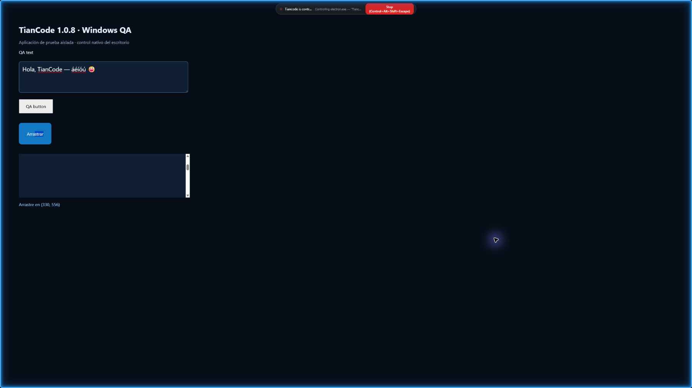

# TianCode 1.0.8 · evidencia de uso de la PC

Fecha: 3 de octubre de 2026. Plataforma de validación nativa: Windows, monitor físico 2560 × 1440. Captura entregada al modelo: 1800 × 1012. Referencia de capacidades: UI-TARS Desktop de ByteDance, Apache-2.0. La integración usa el agente y el proveedor de la conversación de TianCode.

## Validación de implementación

| Comprobación | Resultado |
| --- | --- |
| Operador, validación de argumentos y adaptador UI-TARS | 44 pruebas, 135 aserciones, sin fallos |
| Herramienta del modelo y puente de escritorio | 4 pruebas, 17 aserciones, sin fallos |
| Puente de previsualización y rutas HTTP | 21 pruebas, 82 aserciones, sin fallos |
| Conservación de perfiles y reconocimiento de datos existentes | 22 pruebas, 69 aserciones, sin fallos |
| Estado del actualizador y suscripciones | 10 pruebas, 25 aserciones, sin fallos |
| Tipos de Schema, backend/tiancode, frontend/app y frontend/desktop | Correctos; ejecutados desde sus paquetes con `bun typecheck` |
| Clientes | Generación de backend/client y SDK JavaScript mediante los scripts del repositorio |
| CLI Windows | Binario compilado ejecutado con `--version`: 1.0.8 |
| CLI macOS y Linux, x64 y arm64 | Compilación y empaquetado; no ejecutados en esos sistemas |

La prueba de contexto grande entrega 160 controles con nombres Unicode de 300 caracteres a la herramienta real. Comprueba que la salida sigue siendo JSON válido, mantiene la identidad de la captura, adjunta la imagen y comunica cuántos controles omitió para respetar su presupuesto de 32 KiB.

## Acciones reales en Windows

El script [qa-computer-use.ts](../../frontend/desktop/scripts/qa-computer-use.ts) importa el operador y el capturador de producción. Abre una aplicación de prueba propia en un perfil aislado y comprueba su estado después de enviar entrada nativa. No replica las acciones en JavaScript.

Se completaron 24 comprobaciones: enumeración y foco de ventana, captura y controles UI Automation, clic, rechazo de una captura ya consumida, escritura Unicode, atajo de teclado, doble clic mediante predicción UI-TARS, clic derecho, arrastre con liberación, desplazamiento en un punto, interrupción durante un arrastre, retirada de la luz azul y bloqueo por el interruptor principal. La interrupción y entrega del evento de liberación se observaron en 85 ms en la última ejecución; este valor es evidencia de esa ejecución, no una garantía de latencia.

El consentimiento está simulado únicamente en esta prueba y limitado al nombre de la aplicación propia. No constituye una prueba de la interacción humana con el diálogo. Las comprobaciones esperan la entrega asíncrona de los eventos de Windows antes de evaluar el estado de la aplicación.

Informe estructurado: [pc-control-1.0.8.json](pc-control-1.0.8.json). Captura real:

## Interfaz y publicación

La interfaz del paquete usa un perfil de prueba separado de la instalación del usuario. Se verifica la guía Observar / Actuar / Verificar, los permisos, la selección persistente del monitor y el texto de la versión. La web incorpora la guía, la imagen real, novedades, enlaces de descarga y traducciones de las nuevas funciones en español e inglés. La guía móvil se comprueba a 390 × 844, sin desbordamiento horizontal.

Los resultados definitivos de empaquetado, publicación y detección de la actualización se registran al terminar la entrega. El instalador y portable se construyen con `TIANCODE_CHANNEL=prod`; sus nombres siguen siendo `Tiancode.exe` y `Tiancode-portable.exe`. Los archivos Windows locales no tienen firma de editor; SHA-256 y el SHA-512 de `latest.yml` verifican integridad.

## Alcance de la evidencia

- Las acciones nativas y la luz azul se probaron en un monitor físico de Windows. Los orígenes negativos, capturas reducidas y bordes normalizados se comprueban con pruebas de las funciones de transformación; no se dispone de una segunda pantalla física para una prueba completa con escalas mixtas.
- La herramienta adjunta la imagen al contexto de la conversación. No se ejecutó una tarea con un proveedor externo de pago ni se usaron las claves de la instalación del usuario. La interpretación visual y el éxito de una tarea dependen del modelo con visión y herramientas seleccionado.
- UI Automation depende de la aplicación. Se marcan los campos de contraseña y no se leen sus valores; esto no garantiza reconocer todos los formularios sensibles de cada aplicación.
- El arrastre mantiene el proceso autorizado durante el recorrido. No se anuncia arrastre entre aplicaciones distintas, ni operadores remotos, Android o entrada nativa en macOS/Linux.
- Las pruebas de conservación usan perfiles aislados. No se ejecutó el instalador encima de la instalación del usuario y no se reinició su aplicación durante el desarrollo.
